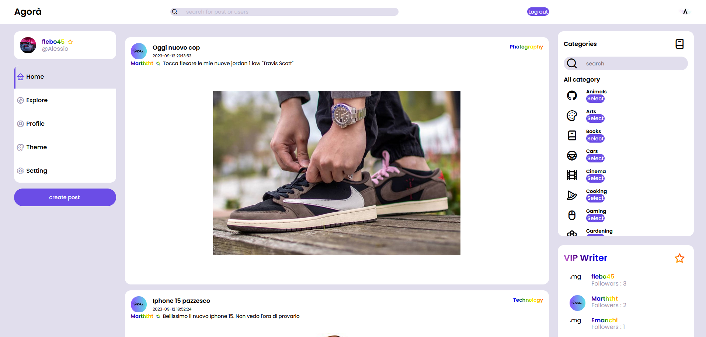
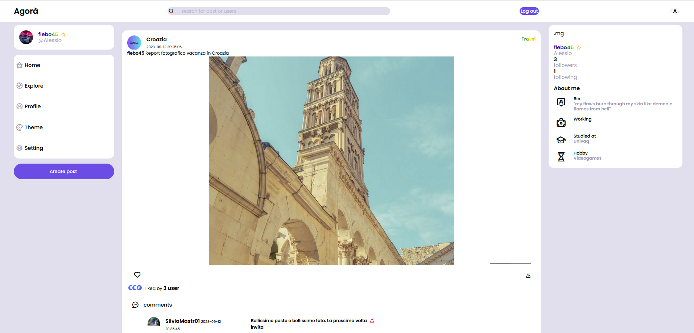

# Agora - The Social Netwok

# Table of Contents

1. [About](#about)
1. [Key Feature](#key-feature)
1. [Requirements](#requirements)
1. [Installation Guide](#installation-guide)
1. [Our Development Team](#our-development-team)

## About

Agora is a Web Application project for the "Web Programming" exam for Univaq(IT).

Agora is a Social Network that utilizes PHP, Doctrine ORM and Smarty.
This app would is intended as a project to lean how to design web applications, using the principles of the **MVC Pattern** and show the potential of our team in the engineering field.

## Key Feature

Agorà is a Social Network Web Application, in which users can share their experience, mood, hobby, thoughts and much more. Every user can create Post and enrich it with photos. But as everythings in the life, there is competition: Top 3 Users (users with the most follower) will be VIP Users.

## Requirements

Installation on local server requirements:

1. Install xampp ([XAMPP Download](https://www.apachefriends.org/it/download.html)) on your machine (inlcluding php)
1. Install composer ([Composer Downlaod](https://getcomposer.org/download/)) on your machine

## Installation Guide

1. Download the git repository;
1. Move the repositoy under `htdocs/` folder in Xampp and rename the folder `Agora`

1. Now you need to install [Doctrine ORM](https://www.doctrine-project.org/), to do that you need to open terminal in the folder of your application (that will be in `xampp/htdocs`) and run `composer install`

1. Once you installed Doctrine Orm, you need to modify some source code in `vendor/` folder; in `/vendor/doctrine/orm/lib/Doctrine/ORM/Configuration.php` at line 150 (approximately) you need to change the `$simpleAnnotationReader` to `false` in the parameter of that function, and delete all references to the SimpleAnnotation Reader in the function

1. On Xampp (you can use phpmyadmin) create a new empty database

1. In the application you can find a folder called `config`, in this folder locate a file called `config.php` and change the parameters according to your xampp and mysql settings

1. Now it's all setup, you only need to create the database tables running `vendor/bin/doctrine orm:schema-tool:create` in the root folder of the application (`xampp/htdocs/Agora`)

1. Open your browser and digit in the URL `localhost/Agora` and enjoy the application

### Our Development team

- [flebo45](https://github.com/flebo45)
- [Marththt](https://github.com/Marththt)
- [SilviaMastracci](https://github.com/SilviaMastracci)
- [Emanchi](https://github.com/Emanchi)
